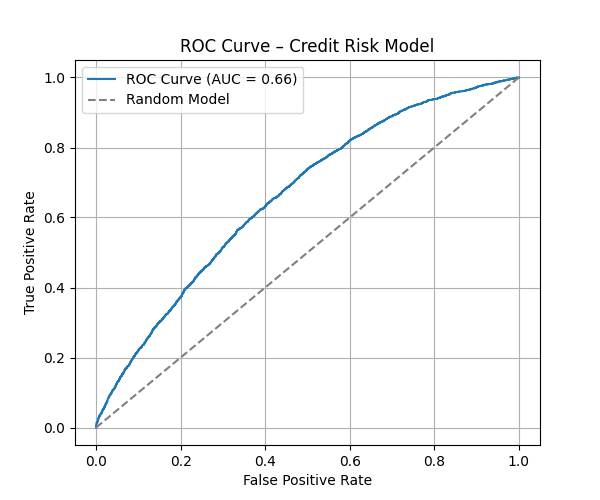

1. Business Understand.

    In credit risk management, financial institutions must continuously assess the probability of default of their clients to support decision-making processes such as credit approval, limit assignment, and risk monitoring.

    In this project, we simulate a scenario in which a financial institution is developing an internal credit risk model to evaluate the likelihood of default among its existing client base. The primary goal is not simply to classify clients as good or bad, but to rank them according to their risk level, enabling more informed and granular decision-making.

    Given the regulatory and operational constraints in credit risk, interpretability plays a central role. The model must provide clear and explainable relationships between input variables and the probability of default, allowing risk analysts and stakeholders to understand the drivers behind each prediction.

    The outputs of this model can be used to:
    - Support internal credit policies (approval/rejection thresholds)
    - Adjust credit limits based on risk exposure
    - Monitor portfolio risk and identify high-risk segments
    - Assist in pricing strategies aligned with client risk profiles

    Therefore, this project focuses on building a robust and interpretable baseline model that balances predictive performance with transparency, aligning with real-world credit risk practices.
2. Data Understanding.

    The dataset employed in this project is the Give Me Some Credit dataset, publicly available on Kaggle (https://www.kaggle.com/c/GiveMeSomeCredit). Kaggle provides multiple files associated with the competition, including training, test, sample entry, and submission files. For the purposes of this study, emphasis is placed on the test.csv file.
    The test.csv file contains over 100,000 observations and 12 predictor variables. The key target variable is SeriousDlqin2yrs, a binary indicator denoting whether an individual has experienced a 90-day past-due delinquency or worse within a two-year horizon. This variable serves as the dependent feature for model training and evaluation, enabling the construction of a supervised learning framework for credit risk prediction.

3. Data Preparation.

    A key concern in building reliable machine learning models is the prevention of data leakage, which occurs when information from outside the training dataset is inadvertently used during model training. This leads to overly optimistic performance metrics and unrealistic results.

    To avoid this issue, the dataset was first split into training and test sets before applying any transformations. All statistical parameters used during feature engineering — such as median imputation and outlier capping — were calculated exclusively on the training set and then applied unchanged to the test set.

    This approach ensures that the model does not have access to future or unseen information during training, closely simulating a real-world scenario where only historical data is available when making predictions.

    Additionally, all transformations were encapsulated in a reusable function, guaranteeing consistency between training and test data processing and reducing the risk of unintended leakage.

    By enforcing this separation, the evaluation metrics (AUC and KS) reflect a more realistic estimate of the model’s performance in production environments.

    Finally, variables with low contribution or unstable behavior are removed to improve the model’s robustness, interpretability, and overall performance.

    This methodological rigor is particularly important in credit risk modeling, where incorrect validation can lead to misleading conclusions and poor business decisions.

4. Modeling. 

    Logistic Regression

    The choice of logistic regression follows directly from the nature of the problem. We do not only need to identify who will default; we also need to estimate how likely each client is to default and understand how each variable contributes to that risk.

    Logistic Regression is suitable for this purpose because it provides transparent interpretability: it quantifies how much each factor influences the predicted outcome, which helps resolve the challenge of understanding the impact of each variable or category. Another important advantage is the stability of the model. Logistic Regression is less prone to severe overfitting and is generally more resilient to noise compared to more complex algorithms.

    For these reasons, logistic regression has become a market standard in credit risk modeling. It allows organizations to extract insights from the data, understand variable relationships, and generate direct, interpretable probability estimates that support credit decision‑making.

    KS + AUC :

    The AUC (Area Under the ROC Curve) provides a global assessment of model performance. It indicates how well the model discriminates between classes across all possible cutoff points. Because it is robust, cutoff‑independent, and summarizes the model’s overall discriminatory power, it is the natural choice for evaluating the model at a strategic level.

    The KS (Kolmogorov–Smirnov statistic), on the other hand, is particularly effective for separating good and bad clients. It is widely used in credit risk because it reflects how well the model supports operational credit decisions, which may vary depending on each organization’s credit policy.

    Using both metrics is important because they serve complementary purposes:

    AUC offers a strategic, holistic view of model performance across the entire client base.

    KS provides an operational perspective, showing how effectively the model distinguishes risk segments in alignment with credit policy.

5. Evaluation. 

    This project demonstrates the development of a credit risk model focused on ranking clients according to their probability of default.

    From a business perspective, such models are essential for financial institutions, as they support decisions related to credit approval, pricing, and risk management.

    Even with a relatively simple and interpretable model (logistic regression), the results show consistent discriminatory power (AUC ≈ 0.66 and KS ≈ 0.24), which is aligned with baseline models commonly used in credit scoring.

    A key strength of this project is the emphasis on methodological correctness, particularly the avoidance of data leakage and the use of appropriate evaluation metrics (AUC and KS), ensuring that the model reflects realistic performance in production scenarios.

    Additionally, the project highlights the importance of feature engineering and economic interpretation, reinforcing that in credit risk modeling, understanding the drivers of default is as important as predictive performance.
